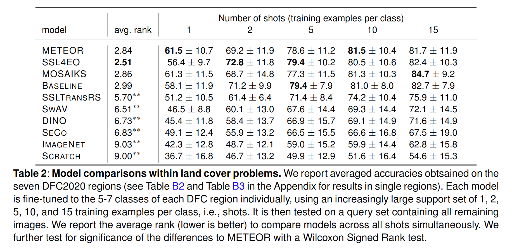
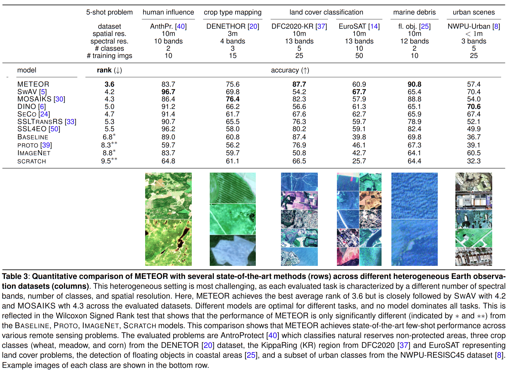

# Experiments

This module contains the source code to reproduce the main experiments in our paper

## Setup

install python evironment

```
python -m venv venv
source venv/bin/activate
pip install -r requirements.txt
```

check `config.yaml` for paths

download all required data and models with
```
python setup.py
```

## Table 2: Comparison within Land Cover Problems

```
python table2.py
```
results of each model will be written in the `results/table2/<shot>/<dfcregion>/<seed>/<model>` folder



## Table 3: Comparison across different Earth Observation Problems

```
python table3.py
```

results of each model will be written in the `results/table3/dataset/<model>` folder


