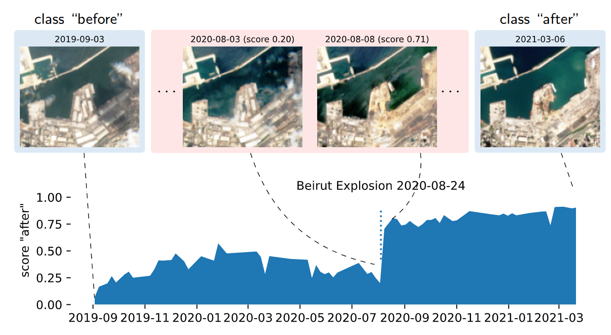

# METEOR


> **Note** Due to many downloads and high associated costs, I had to set the AWS s3 storage of data and models to private. Please email marc . russwurm (at) wur.nl if you need access to the data and models!

## Install Package and Requirements

```commandline
pip install git+https://github.com/marccoru/meteor.git
```

## Getting Started

```python
from meteor import METEOR
from meteor import models
import torch

# initialize an RGB model
basemodel = models.get_model("maml_resnet12", subset_bands=["S2B4", "S2B3", "S2B2"])
taskmodel = METEOR(basemodel)

# fine-tune model to labelled data
X_support, y_support = torch.rand(10, 3, 128, 128), torch.randint(3, (10,))
taskmodel.fit(X_support, y_support)

# predict
X_query = torch.rand(10, 3, 128, 128)
y_pred, y_scores = taskmodel.predict(X_query)
```

## (Coarse) Segmentation

```python
from meteor import METEOR
from meteor import models
import torch

# initialize an RGB model
basemodel = models.get_model("maml_resnet12", subset_bands=["S2B4", "S2B3", "S2B2"], segmentation=True)
taskmodel = METEOR(basemodel)

# fine-tune model to labelled data
X_support, y_support = torch.rand(10, 3, 128, 128), torch.randint(3, (10, 128, 128))
taskmodel.fit(X_support, y_support)

# predict
X_query = torch.rand(10, 3, 128, 128)
y_pred, y_scores = taskmodel.predict(X_query)
```


## Minimal Working Examples 

require installation of extra packages for plotting via `pip install -e "git+https://github.com/marccoru/meteor.git[examples]"`

### Beirut Example



```python
import torch
from meteor import METEOR
from meteor import models
from meteor.examples.beirut import get_data, plot

# download data
timeseries, dates_dt = get_data()

# select support images from time series (first and last <shot> images)
shot = 3

start = timeseries[:shot]
end = timeseries[-shot:]
X_support = torch.vstack([start, end])
y_support = torch.hstack([torch.zeros(shot), torch.ones(shot)]).long()

# get model
s2bands = ["S2B1", "S2B2", "S2B3", "S2B4", "S2B5", "S2B6", "S2B7", "S2B8", "S2B8A", "S2B9", "S2B10", "S2B11",
           "S2B12"]
model = models.get_model("maml_resnet12", subset_bands=s2bands)
taskmodel = METEOR(model, verbose=True, inner_step_size=0.4, gradient_steps=20)

# fit and predict
taskmodel.fit(X_support, y_support)
y_pred, y_score = taskmodel.predict(timeseries)

# plot score
plot(y_score, dates_dt)
```

## Training METEOR

the main training script is located in [`train/main.py`](./train/main.py)

call it via
```
python train/main.py --start-from-pretrained
```

## Demo Application

run app

```
cd app

# install python and requirements
bash setup.sh

# start server
env/bin/python serve.py
```
